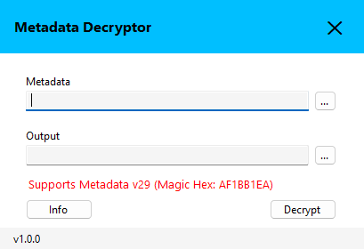

# Metadata Decryptor GUI

A high-performance, standalone Windows utility designed to parse and decrypt global metadata structures from binary files. 

---

  

---

## 🚀 How to Use

1. Launch the application (`.exe`).
2. Click the **Browse** button to open the file explorer and select your target `global-metadata.dat` file.
3. Click the **Decrypt** button to initiate the decryption process.
4. The decrypted output will be processed and saved automatically.

---

## ⚠️ Important Notice

* **Supported Version Only:** This tool currently supports **Metadata Version 29** exclusively.
* **Magic Hex Validation:** The engine strictly validates the file header against the specific Magic Hex: `AF 1B B1 EA`

> [!CAUTION]
> If your file does not match the Metadata v29 structure or contains a different Magic Hex header, the decryption process will fail to prevent data corruption.

---

## 📦 Download & Installation

1. Navigate to the **[Releases](../../releases)** tab on the right side of this repository.
2. Download the specific executable file (`.exe`) matching your system architecture:
   * **`Metadata Decryptor x64.exe`** (For 64-bit Windows)
   * **`Metadata Decryptor x86.exe`** (For 32-bit Windows)
3. Run the downloaded executable directly—no installation or extraction required (Fully Portable).

---

## Author

- [DS Gaming - Mr D](https://github.com/dsgaming-mrd)

---

## Disclaimer

This project is for educational and research purposes only.
